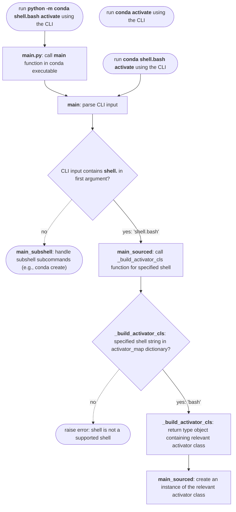

# Flowchart of Activation Process

```mermaid
%%{init: {"flowchart": {"htmlLabels": false}} }%%
flowchart TD
	start1(["`run **conda shell.bash activate** using the CLI`"])
	start2(["`run **python -m conda shell.bash activate** using the CLI`"])
	start3(["`run **conda activate** using the CLI`"])
	
	s2i["`**__main__.py**: call **main** function in conda executable`"]
	m1["`**main**: parse CLI input`"]
	
	m1.D{"`CLI input contains **shell.** in first argument?`"}
	m1.D1(["`**main_subshell**: handle subshell subcommands (e.g., conda create)`"])
	m2["`**main_sourced**: call _build_activator_cls function for specified shell`"]
	
	m2.D{"`**_build_activator_cls**: specified shell string in activator_map dictionary?`"}
	m2.D1(["`raise error: shell is not a supported shell`"])
	m3["`**_build_activator_cls**: return type object containing relevant activator class`"]
    
    m4["`**main_sourced**: create an instance of the relevant activator class`"]

	start2 --> s2i
	s2i --> m1
	start1 --> m1
	
	m1 --> m1.D
	m1.D -. no .-> m1.D1
	m1.D -- "yes: 'shell.bash'" --> m2

	m2 --> m2.D
	m2.D -. no .-> m2.D1
	m2.D -- "yes: 'bash'" --> m3

    m3 --> m4
```