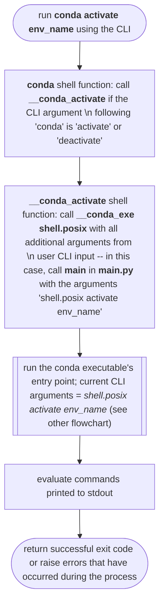

# Flowcharts of Activation Process

## Function calls
```mermaid
flowchart TD
	start(["user runs `conda activate`, followed by an appropriate prefix or environment name, via the CLI"])

	m1["`conda` shell function: call `__conda_activate` shell function"]
	
	m2["`__conda_activate` shell function: call `__conda_exe`, with an argument specifying the type of shell, along with all arguments from user CLI input"]

	m3["`main`: parse and clean CLI input, call `main_sourced`, passing in all cleaned arguments"]

	m4["`main_sourced`: initialize context and context logging, call `_build_activator_cls` function for specified shell"]

	m5["`_build_activator_cls`: return type object containing the activator class for the specified shell`"]

	m6["`main_sourced`: create an instance of the relevant activator class and pass in all arguments"]

	m7["`main_sourced`: call the `_Activator.execute` method, via the activator class instance"]

	m8["`_Activator.execute`: call the `_Activator._parse_and_set_args` method with any CLI arguments passed into the class at initialization"]

	m9["`_Activator._parse_and_set_args`: parse arguments to determine what process the user requires and whether there are any argument errors"]

	m10["`_Activator._parse_and_set_args`: set `self.command` to the desired command (that is, `activate`, `deactivate`, `reactivate` `commands` or `hook`)"]

	m11["`_Activator.execute`: call the `_Activator` method with the value assigned to `self.command` -- in this case, `_Activator.activate`"]

	m12["`_Activator.activate`: call `_Activator._build_activate_stack` with the user-supplied environment name or prefix and the `stack` argument set to True/False, depending on the value of `self.stack` "]
	
	m13["`_Activator._build_activate_stack`: Return dictionary with key-value pairs containing the environmental variables to be set, unset, and exported, as well as any scripts to be run on activation or deactivation (as relevant)"]

	m14["`_Activator.activate`: Assign dictionary returned by `_Activator._build_activate_stack` to `builder_result`"]

	m15["`_Activator.activate`: Call `_Activator._yield_commands` and pass in `builder_result`"]

	m16["`_Activator._yield_commands`: Format the values in the `builder_result` dictionary so that they can be read by the relevant shell (using the template variables set in the relevant shell’s activator class)"]

	m17["`_Activator._yield_commands`: Use `yield` to return, in order, the formatted: export path, deactivate scripts, environment variables to be unset, environment variables to be set, environment variables to be exported, activate scripts"]

	m18["`_Activator.activate`: Call `_Activator._finalize` and pass in the yielded return values and the relevant temporary file extension, if one exists`"]
	
	m19["`_Activator._finalize`: Return a string that contains all the commands to be evaluated, joined together using the string separator assigned to self.command_join, or a temporary file that contains this string"]
	
	m20["`_Activator.execute`: return the return value from `_Activator.activate`"]

	m21["`main_sourced`: print the return value from `_Activator.execute` to the terminal. End with an empty string rather than with a new line"]
	
	End1(["return successful exit code or raise errors that have occurred during the process"])


	start --> m1
	m1 --> m2
	m2 --> m3
	m3 --> m4
	m4 --> m5
	m5 --> m6
	m6 --> m7
	m7 --> m8
	m8 --> m9
	m9 --> m10
	m10 --> m11
	m11 --> m12
	m12 --> m13
	m13 --> m14
	m14 --> m15
	m15 --> m16
	m16 --> m17
	m17 --> m18
	m18 --> m19
	m19 --> m20
	m20 --> m21
	m21 --> End1
```


## Run `conda activate` from the CLI


## Run `conda shell.bash activate` from the CLI
```mermaid
%%{init: {"flowchart": {"htmlLabels": false}} }%%
flowchart TD
	start1(["`run **conda shell.bash activate env_name** using the CLI`"])
	start2(["`run **python -m conda shell.bash activate env_name** using the CLI`"])
	start3(["`run the conda executable's entry point; current CLI arguments = *shell.posix activate env_name*`"])
	
	s2i["`**__main__.py**: call **main** function in conda executable`"]
	m1["`**main**: parse and clean CLI input`"]
	
	m1.D{"`CLI input contains **shell.** in first argument?`"}
	m1.D1(["`**main_subshell**: handle subshell subcommands (e.g., conda create)`"])
	
	m2["`**main_sourced**: initialize **context** and context logging`"]

	m3["`call _build_activator_cls function for specified shell -- in this case, 'bash' or 'posix'`"]
	m3.D{"`**_build_activator_cls**: specified shell string \n in activator_map dictionary?`"}
	m3.D1(["`raise error: shell is not a supported shell`"])
	m4["`**_build_activator_cls**: return type object containing relevant activator class`"]

	m5["`create a class instance of the relevant activator class -- in this case, PosixActivator. \n Through this process, the necessary facets of the relevant shell scripting language are declared for later use.`"]

	m6["`call *_Activator's* **execute** method.`"]

	m7["`**_Activator.execute**: calls *_Activator's* **_parse_and_set_args** method with any CLI arguments passed into the class at initialization)`"]
	
	m7.D{"`**_Activator._parse_and_set_args**: \n Is the arguments list missing or empty?`"}
	m7.D1(["`Raise error and send a warning / informational message to the command line, using \n the **raise_invalid_command_error** helper function`"])

	m8i["`Separate *command* (first CLI argument in argument list) from remaining arguments`"]
	m8ii["`Separate remaining arguments that are not help flags into a tuple; assign tuple to *non_help_args*`"]
	m8iii["`Set *help_requested* to boolean value that indicates if there are help flags in the remaining arguments`"]
	m8iv["`Clean the remaining arguments: put arguments from *non_help_args* that are \n not empty strings, not otherwise falsy and not a duplicate of the command into a list`"]
	
	
	m8.Di{"`Is the command argument an empty string?`"}
	
	m8.Dii{"`Are there help flags in \n the arguments list?`"}
	m8.Dii.1(["`Bring up the appropriate help message`"])
	
	m8.Diii{"`Is *command* NOT a conda \n shell command ('activate', 'deactivate', \n 'hook', 'commands', or 'reactivate')?`"}

	m8.Div{"`Does *command* end with 'activate' or is *command* 'hook'?`"}

	m9["`Check for the '--dev' flag in the list of remaining arguments`"]
	
	m9.D{"`Is the '--dev' flag in the list of remaining arguments?`"}
	m9.D1["`Set *context.dev* to *False*`"]
	m9.D2["`Delete the '--dev' flag from the list \n of arguments and set *context.dev* to *True*`"]
	
	m8.Dv{"`Is *command* 'activate'?`"}
	m8.Dv.1["`Set *self.stack* to *context.auto_stack* only if \n *context.shlvl* is less than *context.auto_stack*`"]
	
	m10["`Set *stack_idx* to the argument list index number \n that contains the '--stack' flag if the flag \n is in the argument list and to \n -1 if the flag is not in the argument list `"]
	m11["`Set *no_stack_idx* to the argument list index number \n that contains the '--no-stack' flag if the flag \n is in the argument list and to \n -1 if the flag is not in the argument list`"]
	
	m11.Di{"`Are both the '--stack' flag and \n the '--no-stack' flag \n in the argument list?`"}
	m11.Di.1(["`Raise error and send message to the command line"])

	m11.Dii{"`Is the '--stack' flag \n in the argument list?`"}
	m11.Dii.1["`Set *self.stack* to *True* and delete the '--stack' flag from the argument list`"]

	m11.Diii{"`Is the '--no-stack' flag \n in the argument list?`"}
	m11.Diii.1["`Set *self.stack* to *False* and delete the '--no-stack' flag from the argument list`"]

	m11.Div{"`Is there more than one argument \n remaining in the argument list?`"}
	m11.Div.1(["`Raise error and send message to the command line"])
	m11.Div.2["`Set *self.env_name_or_prefix* to the remaining argument \n -- in this case, 'env_name' -- or to 'base' if no arguments remain`"]

	m12["`Set *self.command* to *command* -- that is, 'activate'. [Implied: return *None*.]`"]


	m13["`**_Activator.execute**: call the *_Activator* method with the value assigned to *self.command* \n -- in this case, **_Activator.activate**`"]

	m14.D{"`Is *self.stack* *True*?`"}
	m14.D1["`Call **_Activator.self.build_stack** and pass in the environment name \n or prefix (*self.env_name_or_prefix* -- in this case, 'env_name')`"]
	
	m49["`**_Activator.execute**: return the return value from **_Activator.activate**"]

	m50["`**main_sourced**: print the return value from **_Activator.execute** to the terminal. \n End with an empty string rather than with a new line`"]

	End1(["`return successful exit code`"])


	start2 --> s2i
	start3 --> s2i	
	s2i --> m1
	start1 --> m1
	
	m1 --> m1.D
	m1.D -. no .-> m1.D1
	m1.D -- "yes: 'shell.bash' or 'shell.posix'" --> m2

	m2 --> m3
	
	m3 --> m3.D
	m3.D -. no .-> m3.D1
	m3.D -- "yes: 'bash' or 'posix'" --> m4

	m4 --> m5
	m5 --> m6
	m6 --> m7

	subgraph a [activate.py]
	m7 --> m7.D

	subgraph b [_Activator._parse_and_set_args]
	m7.D -. yes .-> m7.D1
	m7.D -- no --> m8i

	m8i --> m8ii
	m8ii --> m8iii	
	m8iii --> m8iv
	m8iv --> m8.Di

	m8.Di -. yes .-> m7.D1
	m8.Di -- "no: 'activate'" --> m8.Dii
	
	m8.Dii -. yes .-> m8.Dii.1
	m8.Dii -- no --> m8.Diii

	m8.Diii -. yes .-> m7.D1
	m8.Diii -- "no: 'activate'" --> m8.Div

	m8.Div -- yes --> m9
	m8.Div -. no .-> m8.Dv
	
	m9 --> m9.D
	
	m9.D -- no --> m9.D1
	m9.D -. yes .-> m9.D2
	m9.D1 --> m8.Dv
	m9.D2 -.-> m8.Dv

	m8.Dv -- yes --> m8.Dv.1
	m8.Dv.1 --> m10
	m10 --> m11

	m11 --> m11.Di
	
	m11.Di -- no --> m11.Dii
	m11.Di -. yes .-> m11.Di.1

	m11.Dii -- no --> m11.Diii
	m11.Dii -. yes .-> m11.Dii.1
	m11.Dii.1 -.-> m11.Diii

	m11.Diii -- no --> m11.Div
	m11.Diii -. yes .-> m11.Diii.1
	m11.Diii.1 -.-> m11.Div

	m11.Div -- "no: the sole remaining argument is 'env_name'" --> m11.Div.2
	m11.Div -. yes .-> m11.Div.1

	m11.Div.2 --> m12
	end

	m12	--> m13
	m13 --> m14.D

	m14.D -. no .-> m14.D1 

	

	end

	m49 --> m50

	m50 --> End1
```